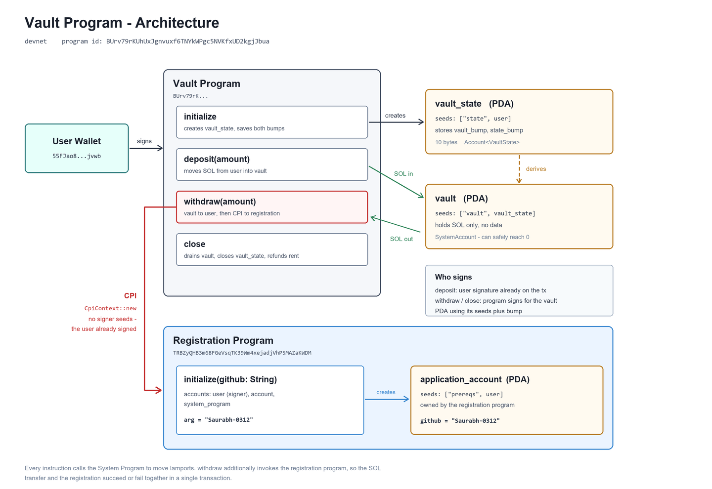

# Turbin3 Builders Cohort — Q3 2026

Assignments, notes, and capstone work.

**Cadet:** Saurabh Singh ([@Saurabh-0312](https://github.com/Saurabh-0312))

| Path | Contents |
|---|---|
| [`prereq/`](prereq/) | Prerequisite challenge — vault program with registration CPI |
| [`assignments/`](assignments/) | Weekly assignments, weeks 1–5 |
| [`capstone/`](capstone/) | Capstone project |
| [`notes/`](notes/) | Learning notes |

---

## Prerequisite Challenge

An Anchor vault program ([`prereq/pre-req-vault/`](prereq/pre-req-vault/)) whose `withdraw`
instruction was extended to perform a CPI into the Turbin3 registration program, recording
a GitHub username on-chain.

### Architecture



Detailed write-up: [`notes/vault-architecture.md`](notes/vault-architecture.md)

### Deployment (devnet)

| | |
|---|---|
| Vault program | `BUrv79rKUhUxJgnvuxf6TNYkWPgc5NVKfxUD2kgjJbua` |
| Registration program | `TRBZyQHB3m68FGeVsqTK39Wm4xejadjVhP5MAZaKWDM` |
| Application account | `3Lu5D243E5Mhw6xFenqBYrwrmynUpVcsXzPtSxsQpwJT` |
| Withdraw tx (CPI) | [`4jB841N3…CTBw8F`](https://explorer.solana.com/tx/4jB841N3QBVA4yWMCcaX2P5wgJM9K6Pems7mdk2NpEtrPtcAACxXtM974Kgex87xexEyct6nw78qoHFhfYCTBw8F?cluster=devnet) |

The application account stores `github = "Saurabh-0312"` —
[view on Explorer](https://explorer.solana.com/address/3Lu5D243E5Mhw6xFenqBYrwrmynUpVcsXzPtSxsQpwJT?cluster=devnet).

### Build and test

Rust 1.95 · Solana CLI 2.2.7 · Anchor 1.1.2 · Node 25 · cluster: devnet

```bash
cd prereq/pre-req-vault
yarn install
cargo build-sbf --tools-version v1.52
anchor idl build -o target/idl/pre_req_vault.json -t target/types/pre_req_vault.ts
solana program deploy target/deploy/pre_req_vault.so

export ANCHOR_PROVIDER_URL="https://api.devnet.solana.com"
export ANCHOR_WALLET="$HOME/.config/solana/id.json"
yarn run ts-mocha -p ./tsconfig.json -t 1000000 "tests/**/*.ts"
```

Starter program forked from [`ShrinathNR/pre-req-vault`](https://github.com/ShrinathNR/pre-req-vault).

---

## References

- [Solana docs](https://solana.com/docs) · [core concepts](https://solana.com/docs/core)
- [Anchor docs](https://www.anchor-lang.com/docs)
- [Solana Stack Exchange](https://solana.stackexchange.com)
