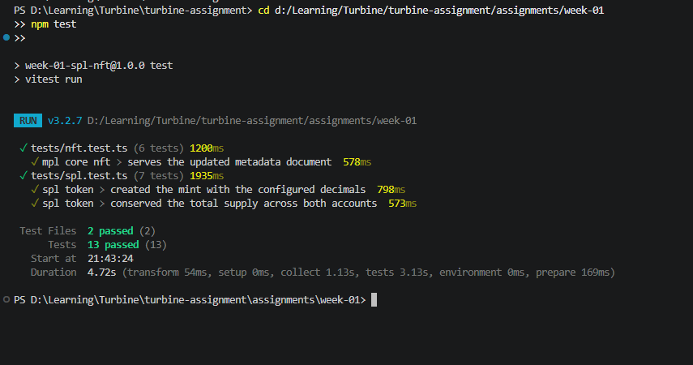

# Week 1 — SPL Token and MPL Core NFT

Turbin3 Builders Cohort Q3 2026. All work runs against **Solana devnet**.

| Task | Status |
|---|---|
| 1. Mint and transfer an SPL token | Done |
| 2. Mint an NFT using MPL Core | Done |
| 3. Update the NFT's name and metadata as update authority | Done |

Extension challenges (transfer and burn) were not attempted.

---

## Stack

No on-chain program is written here. Every task is a client calling programs that are
already deployed — the SPL Token Program and the MPL Core Program.

| Library | Used for |
|---|---|
| `@solana/kit`, `@solana-program/token`, `@solana-program/system` | mint creation, ATAs, mint-to, transfer |
| `@metaplex-foundation/mpl-token-metadata` (Umi) | name, symbol and URI on the fungible mint |
| `@metaplex-foundation/mpl-core` (Umi) | creating and updating the NFT |
| `vitest` | verifying on-chain state |

Image and metadata JSON are served from this repository over
`raw.githubusercontent.com` rather than an uploader service, so every URI is
reproducible and version controlled.

---

## Layout

```
week-01/
├── assets/
│   ├── dodge-challenger.png      artwork referenced by both metadata documents
│   ├── token.json                SPL token metadata
│   ├── nft.json                  NFT metadata at mint time
│   └── nft-updated.json          NFT metadata after the update
├── src/
│   ├── lib/                      rpc clients, wallet loading, shared config, artifact store
│   ├── spl/                      spl_init, spl_metadata, spl_mint, spl_transfer
│   └── nft/                      nft_mint, nft_update
├── tests/                        spl.test.ts, nft.test.ts
└── artifacts.json                addresses and signatures produced by the scripts
```

Each script writes its output to `artifacts.json` and the next script reads from it,
so the pipeline runs end to end without copying addresses by hand. The tests read the
same file and then query devnet directly.

---

## Setup

Requires Node 20+ and a funded devnet keypair.

```bash
npm install
```

The scripts read the keypair from `~/.config/solana/id.json`. Point `WALLET_PATH` at a
different file to override it. No key material is stored in this repository.

```bash
solana config set --url devnet
solana balance
```

## Running

Run in order. Each step depends on the artifacts written by the previous one.

```bash
npm run spl:init        # create the mint
npm run spl:metadata    # attach name, symbol and URI
npm run spl:mint        # create the owner ATA and mint the supply
npm run spl:transfer    # create the recipient ATA and transfer
npm run nft:mint        # create the MPL Core asset
npm run nft:update      # change the asset's name and URI
npm test                # verify everything against devnet
```

---

## Task 1 — SPL token

A mint with 6 decimals. 1,000 tokens were minted to the wallet's associated token
account, then 250 transferred to a second wallet whose ATA is created in the same
transaction. Transfer uses `TransferChecked`, which validates the decimals on chain.

| | |
|---|---|
| Mint | [`AjbayCwY5udQxpgn6Jg6yFMVZxCgye96QWQT225hBQFu`](https://explorer.solana.com/address/AjbayCwY5udQxpgn6Jg6yFMVZxCgye96QWQT225hBQFu?cluster=devnet) |
| Name / symbol | Challenger Token / CHLGR |
| Decimals | 6 |
| Owner ATA | [`6mDpKmZLqmL3cqBUXDjhSXU7cE88B7Q3egU42XtrLFJo`](https://explorer.solana.com/address/6mDpKmZLqmL3cqBUXDjhSXU7cE88B7Q3egU42XtrLFJo?cluster=devnet) |
| Recipient | [`3UQic4bNpbZPUdqwMCzSprLPNA9NMVKwk24n1AgK8kgZ`](https://explorer.solana.com/address/3UQic4bNpbZPUdqwMCzSprLPNA9NMVKwk24n1AgK8kgZ?cluster=devnet) |
| Recipient ATA | [`9MgNo9ncDmXpe4TkGfUeS93xPvjX8cSrGHzrpuAvsNZP`](https://explorer.solana.com/address/9MgNo9ncDmXpe4TkGfUeS93xPvjX8cSrGHzrpuAvsNZP?cluster=devnet) |
| Minted / transferred | 1,000.000000 / 250.000000 |

| Step | Signature |
|---|---|
| Create mint | [`3kvkLLr3…9WYJ29`](https://explorer.solana.com/tx/3kvkLLr32Bom8HQw9UycaVUxk89ui3r8BQeujdzsYCanSi4YxmRZMhittppeBYDJePnnayGGM8Jpt8AZer9WYJ29?cluster=devnet) |
| Attach metadata | [`2bCC1SSJ…ouQgs`](https://explorer.solana.com/tx/2bCC1SSJVDx8kbVWK4qrYFBY9udek7BhSpkFZREY3m78HyLkrWMD58VMgKixyYddedMJjDXLkSefJV4qW21ouQgs?cluster=devnet) |
| Mint supply | [`4LZ7Vqux…JcMVam`](https://explorer.solana.com/tx/4LZ7Vquxadnjo5ZJufG8WBFEoP3V44c3FhSwXq2hjuSwjuRRhh4vCHHky1SJy9JRH2HicpDFY1Y622sDc5JcMVam?cluster=devnet) |
| Transfer | [`3h8d2kap…bdL5J`](https://explorer.solana.com/tx/3h8d2kapBH6DXuiaYyQhGNaUyT9rpsFCrTKPeanpugrUmySBtCQHVu2C2dV7FtZFjeQGVtxHRTSAsbLvwJpbdL5J?cluster=devnet) |

## Tasks 2 and 3 — MPL Core NFT

MPL Core stores an NFT as a **single account**, unlike Token Metadata which needs a
mint, a token account, a metadata account and a master edition. The asset was minted
with the wallet as both owner and update authority, then updated.


| | |
|---|---|
| Asset | [`2vMZfV9JmABqgVZrZYPjxPZFeVCguKF3nvBRWLPcFxTs`](https://explorer.solana.com/address/2vMZfV9JmABqgVZrZYPjxPZFeVCguKF3nvBRWLPcFxTs?cluster=devnet) |
| Owner / update authority | `55FJao825sA7rR9aKNtUEuGzN2gQNN9nZBw41WCWjvwb` |
| Name before → after | Dodge Challenger → **Dodge Challenger R/T Scat Pack** |
| URI before → after | [`nft.json`](assets/nft.json) → [`nft-updated.json`](assets/nft-updated.json) |

| Step | Signature |
|---|---|
| Mint asset | [`4SzaCvmY…UDEEhz`](https://explorer.solana.com/tx/4SzaCvmYZbHKZGysmzU7Kww64z1mwHbwxKqoZtG5rZv2DhtUh6MovHBuFf5tgeipyGY5Jh5RJ5KABhrrixUDEEhz?cluster=devnet) |
| Update name and URI | [`28V3qsAn…xUXUXk`](https://explorer.solana.com/tx/28V3qsAnsecXaCBNthGWpvsXzJpjLoreqFwERKi4qgfVzJcSYoXQyi8d4UFZAkNYs9WyxHapAHFdZ8kNiqxUXUXk?cluster=devnet) |

The update also rewrites the attributes: the updated document adds trim and engine
traits, so the change is visible in the metadata as well as in the on-chain name.

---

## Tests

`npm test` fetches live devnet state rather than replaying the scripts, so a passing
run proves the chain holds the expected values.

**SPL token**
- the mint exists with 6 decimals
- the wallet is still the mint authority
- the Token Metadata account carries the expected name, symbol and URI
- the owner ATA holds supply minus the transferred amount
- the recipient ATA holds exactly the transferred amount
- both balances sum to the minted supply

**MPL Core NFT**
- the asset exists and is owned by the wallet
- the wallet is the update authority
- the name equals the updated value and no longer equals the original
- the URI equals the updated value and no longer equals the original
- the URI resolves and the served document matches the on-chain name



---

## Notes

Reading an account immediately after `sendAndConfirm` can return a pre-transaction
slot, which made an early version of `nft_update` report no change even though the
transaction succeeded. The script now polls until the account reflects the expected
state before writing artifacts, and fails loudly if it never does.
