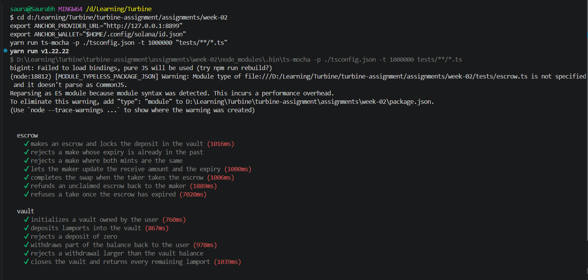

# Week 2 — Vault and Escrow

Two Anchor programs in one workspace: a native SOL vault, and an SPL token escrow
with a timed expiry driven by the clock sysvar.

| Program | ID (localnet) |
|---|---|
| `vault` | `4QpzuCnfUqGRrmeHA9mtLuaFGRnz9VLmLnaaSpUojQvV` |
| `escrow` | `FnzppdD95wjWgbQJ6TfW5zmvngVCtfrJEEeG4zULfjfR` |

Anchor 0.32 · Rust 1.95 · Solana CLI 2.2.7 · tested against a local validator.

---

## Vault

A per-user SOL vault. Two PDAs, chained:

```
user  --["state", user]-->  vault_state  --["vault", vault_state]-->  vault
```

`vault_state` is a 42-byte account holding the owner and both bumps. `vault` is a
`SystemAccount` holding lamports and no data, so its balance can safely reach zero
without breaking rent exemption.

| Instruction | Effect | Signer |
|---|---|---|
| `initialize` | Creates `vault_state`, stores owner and both bumps | user |
| `deposit(amount)` | Moves lamports user → vault | user |
| `withdraw(amount)` | Moves lamports vault → user | `vault` PDA via seeds |
| `close` | Drains the vault, closes `vault_state`, refunds rent | `vault` PDA via seeds |

`deposit` uses `CpiContext::new` because the user already signed the transaction.
`withdraw` and `close` use `CpiContext::new_with_signer`, since lamports leave a PDA
that has no private key.

**Guards:** `InvalidAmount` on zero amounts, `InsufficientFunds` when a withdrawal
exceeds the balance. Ownership is enforced by the `["state", user]` seed, so one user
can never address another user's vault.

---

## Escrow

A maker locks `mint_a` in a vault and names the amount of `mint_b` they want. A taker
fills it atomically, or the maker refunds. State lives in one PDA:

```
["escrow", maker, seed]  ->  Escrow { seed, maker, mint_a, mint_b, receive, expiry, bump }
```

The vault is the associated token account for `mint_a` owned by the escrow PDA.

| Instruction | Effect | Signer |
|---|---|---|
| `make(seed, deposit, receive, expiry)` | Creates the escrow, moves `deposit` of `mint_a` into the vault | maker |
| `take` | Taker pays `receive` of `mint_b` to maker, receives the vault's `mint_a`, both accounts close | taker |
| `refund` | Returns the vault to the maker, both accounts close | maker + escrow PDA |
| `update(receive, expiry)` | Maker revises the asking amount and the deadline | maker |

`take` and `refund` sign as the escrow PDA to move tokens out of the vault and to
close it. `has_one` constraints tie the escrow to its maker and both mints, so a
caller cannot substitute a different mint or redirect the proceeds.

**Guards:** `InvalidAmount`, `InvalidExpiry`, `IdenticalMints`, `EscrowExpired`.

### Timed escrow (extension challenge 4)

Every escrow carries an `expiry: i64` unix timestamp, validated against
`Clock::get()?.unix_timestamp`:

- `make` rejects an expiry that is already in the past
- `take` rejects once `unix_timestamp` passes `expiry`, so a stale offer cannot be
  filled at a price the maker no longer wants
- `update` lets the maker extend the deadline and change the asking amount
- `refund` stays available to the maker at any time, so funds are never stranded

---

## Build and test

Solana tooling on Windows needs two flags that the plain Anchor commands do not set,
so the build and test steps are run individually.

```bash
cargo build-sbf --tools-version v1.52

mkdir -p target/idl target/types
anchor idl build -p vault  -o target/idl/vault.json  -t target/types/vault.ts
anchor idl build -p escrow -o target/idl/escrow.json -t target/types/escrow.ts

yarn install
```

Start a validator in one terminal:

```bash
solana-test-validator --reset
```

Deploy and run the suite in another:

```bash
solana program deploy target/deploy/vault.so  --program-id target/deploy/vault-keypair.json  --url http://127.0.0.1:8899
solana program deploy target/deploy/escrow.so --program-id target/deploy/escrow-keypair.json --url http://127.0.0.1:8899

export ANCHOR_PROVIDER_URL="http://127.0.0.1:8899"
export ANCHOR_WALLET="$HOME/.config/solana/id.json"
yarn run ts-mocha -p ./tsconfig.json -t 1000000 "tests/**/*.ts"
```

---

## Tests

13 tests covering every instruction in both programs, plus the failure paths.



**Vault**

| Test | Verifies |
|---|---|
| initializes a vault owned by the user | owner and both bumps are stored |
| deposits lamports into the vault | vault balance increases by the exact amount |
| rejects a deposit of zero | `InvalidAmount` |
| withdraws part of the balance back to the user | vault decreases, user increases |
| rejects a withdrawal larger than the vault balance | `InsufficientFunds` |
| closes the vault and returns every remaining lamport | vault at zero, `vault_state` gone, user refunded |

**Escrow**

| Test | Verifies |
|---|---|
| makes an escrow and locks the deposit in the vault | state fields written, tokens moved out of the maker |
| rejects a make whose expiry is already in the past | `InvalidExpiry` |
| rejects a make where both mints are the same | `IdenticalMints` |
| lets the maker update the receive amount and the expiry | new terms persisted |
| completes the swap when the taker takes the escrow | both sides credited, escrow and vault closed |
| refunds an unclaimed escrow back to the maker | maker made whole, accounts closed |
| refuses a take once the escrow has expired | `EscrowExpired` after the deadline passes |

The expiry test creates an escrow two seconds out, waits for the deadline to pass,
then asserts the take is rejected and the stored expiry is behind the chain clock.

---

## Scope

Tasks 1–3 and extension challenge 4 are implemented. The advanced challenge 5, a
non-custodial vault redeemable in kind, is not attempted.
