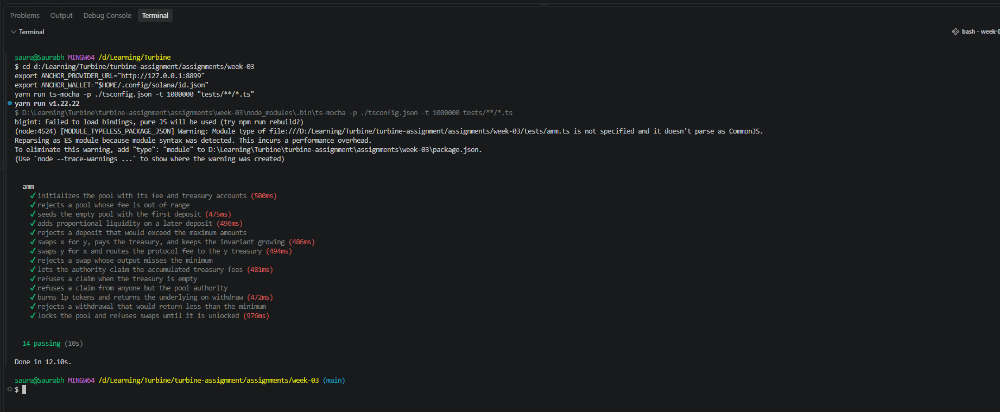

# Week 3 — Constant Product AMM

An Anchor automated market maker over the `x * y = k` curve, with a swap fee that
stays with the liquidity providers and a separate protocol fee that accrues to a
treasury the pool authority can claim.

| | |
|---|---|
| Program | `amm` |
| ID (localnet) | `GiqnyeLkBP3ZoJBGYuyAPX81FYom7n683h9uFrXafF3a` |
| Curve | [`constant-product-curve`](https://github.com/deanmlittle/constant-product-curve) |

Anchor 0.32 · Rust 1.95 · Solana CLI 2.2.7 · tested against a local validator.

---

## Accounts

Every pool is addressed by a `seed`, so one deployment can host many pools over the
same pair of mints.

| Account | Address | Holds |
|---|---|---|
| `config` | `["config", seed]` | pair, fees, authority, bumps, lock flag |
| `mint_lp` | `["lp", config]` | LP mint, 6 decimals, authority is `config` |
| `vault_x` | ATA of `mint_x` for `config` | pooled X |
| `vault_y` | ATA of `mint_y` for `config` | pooled Y |
| `treasury_x` | `["treasury_x", config]` | protocol fees collected in X |
| `treasury_y` | `["treasury_y", config]` | protocol fees collected in Y |

`config` is the authority over the vaults, the treasuries and the LP mint, so every
outbound transfer and every mint or burn is signed by the program with the config
seeds rather than by any user.

```rust
pub struct Config {
    pub seed: u64,
    pub authority: Pubkey,
    pub mint_x: Pubkey,
    pub mint_y: Pubkey,
    pub fee: u16,
    pub protocol_fee: u16,
    pub locked: bool,
    pub config_bump: u8,
    pub lp_bump: u8,
}
```

---

## Instructions

| Instruction | Effect | Signer |
|---|---|---|
| `initialize(seed, fee, protocol_fee)` | Creates the config, LP mint, both vaults and both treasuries | authority |
| `deposit(amount, max_x, max_y)` | Adds liquidity, mints `amount` LP tokens | user |
| `withdraw(amount, min_x, min_y)` | Burns `amount` LP, returns the underlying | user |
| `swap(is_x, amount, min)` | Trades one side for the other | user |
| `claim()` | Sweeps both treasuries to the authority | authority |
| `set_locked(locked)` | Halts deposits, withdrawals and swaps | authority |

`deposit` seeds an empty pool with `max_x` and `max_y` directly, since the curve is
undefined at zero reserves. Afterwards it derives both legs from the LP amount with
`xy_deposit_amounts_from_l`, so later deposits cannot shift the price.

---

## Fees and the treasury

There are two independent fees, and they behave differently on purpose.

**`fee`** is the usual AMM swap fee in basis points. The curve credits the pool with
the full input but computes the output from `amount * (10000 - fee) / 10000`, so the
difference stays in the vaults. It never leaves, which is what makes an LP position
grow.

**`protocol_fee`** is taken in the input mint *before* the curve sees the trade:

```
protocol_amount = amount * protocol_fee / 10000
swap_amount     = amount - protocol_amount
```

`swap_amount` goes through the curve, `protocol_amount` is transferred to
`treasury_x` or `treasury_y` depending on the direction of the trade. Because the
cut is removed up front it never enters the reserves, so it cannot distort the price
or be withdrawn by liquidity providers.

`claim` moves both treasury balances to the authority's token accounts, signed by the
config PDA. It is gated by `has_one = authority` and refuses to run against an empty
treasury.

---

## Build and test

Solana tooling on Windows needs flags the plain Anchor commands do not set, so each
step is run on its own.

```bash
cargo build-sbf --tools-version v1.52

mkdir -p target/idl target/types
anchor idl build -p amm -o target/idl/amm.json -t target/types/amm.ts

yarn install
```

Start a validator in one terminal:

```bash
solana-test-validator --reset
```

Deploy and run the suite in another:

```bash
solana program deploy target/deploy/amm.so --program-id target/deploy/amm-keypair.json --url http://127.0.0.1:8899

export ANCHOR_PROVIDER_URL="http://127.0.0.1:8899"
export ANCHOR_WALLET="$HOME/.config/solana/id.json"
yarn run ts-mocha -p ./tsconfig.json -t 1000000 "tests/**/*.ts"
```

Every account struct that touches more than a few token accounts boxes them. Without
that the generated `try_accounts` frames run past the 4 KB BPF stack limit and the
build reports a stack offset error.

---

## Tests



| Test | Verifies |
|---|---|
| initializes the pool with its fee and treasury accounts | config fields, empty treasuries, zero LP supply |
| rejects a pool whose fee is out of range | `InvalidFee` at 10000 bps |
| seeds the empty pool with the first deposit | both vaults funded, LP minted one for one |
| adds proportional liquidity on a later deposit | reserve ratio is preserved |
| rejects a deposit that would exceed the maximum amounts | `SlippageExceeded` |
| swaps x for y, pays the treasury, and keeps the invariant growing | output received, `treasury_x` credited, `k` never decreases |
| swaps y for x and routes the protocol fee to the y treasury | fee lands in the matching treasury |
| rejects a swap whose output misses the minimum | `SlippageExceeded` |
| lets the authority claim the accumulated treasury fees | treasuries emptied into the authority |
| refuses a claim when the treasury is empty | `NothingToClaim` |
| refuses a claim from anyone but the pool authority | `ConstraintHasOne` |
| burns lp tokens and returns the underlying on withdraw | supply falls, reserves fall, user is paid |
| rejects a withdrawal that would return less than the minimum | `SlippageExceeded` |
| locks the pool and refuses swaps until it is unlocked | `PoolLocked`, then recovery |

The swap test asserts that `vault_x * vault_y` never decreases across a trade, which
is the property the whole design rests on.

---

## Scope

Tasks 1, 2 and 3 are implemented. The optional extensions, a hand rolled CPMM and the
downtime write up, are not attempted.
