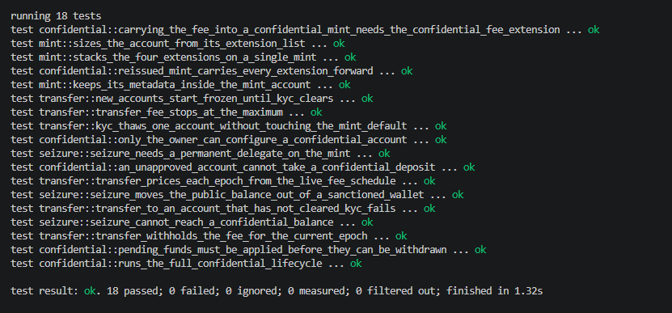

# Week 4 — Token-2022 Remittance Stablecoin

An Anchor program that issues a remittance stablecoin on Token-2022. Every transfer
pays the issuer a protocol fee, new accounts are frozen until they clear KYC, the
metadata lives inside the mint, and the mint can be closed if it is ever retired.
A second issuance adds confidential transfers and a seizure authority, and the
confidential lifecycle is exercised end to end with real zero-knowledge proofs.

| | |
|---|---|
| Program | `stablecoin` |
| ID | `ZsyntkiEGwSPtXwAUe72QhuPBhyi91jA4244YKpuNc4` |
| Token program | Token-2022 `8.0.1` client · `8.0.0` on-chain in program-test |
| Proofs | `solana-zk-sdk 2.3.13` · `spl-token-confidential-transfer-proof-generation 0.4.0` |

Anchor 0.32 · Rust 1.95 · Solana CLI 2.2.7 · tested with `solana-program-test 2.3.13`.

---

## Design

One PDA, `["issuer", admin]`, holds every authority on every mint it issues: mint,
freeze, transfer fee config, withdraw withheld, metadata update, mint close,
permanent delegate and confidential transfer. No privileged action can happen
outside the program, and each one is gated by `has_one = admin`.

| Instruction | Purpose |
|---|---|
| `initialize_issuer` | Creates the issuer PDA for an admin |
| `create_mint` | Task 1 — the four-extension stablecoin |
| `create_confidential_mint` | Task 5 — the re-issue with confidentiality and seizure |
| `issue` | Mints to a KYC-cleared account |
| `approve_kyc` | Task 4 — thaws one account |
| `sanction` | Freezes one account |
| `transfer_with_fee` | Task 2 — fee-bearing transfer priced from the live epoch |
| `update_transfer_fee` | Schedules a new fee through `SetTransferFee` |
| `approve_confidential_account` | Approves an account under the manual policy |
| `seize` | Moves a sanctioned wallet's public balance to a treasury |

---

## Task 1 — Stacking the extensions

`create_mint` builds the mint inside the program, in this order:

```
create_account                      space = try_calculate_account_len::<Mint>(&[
                                        TransferFeeConfig,
                                        MetadataPointer,
                                        DefaultAccountState,
                                        MintCloseAuthority,
                                    ])
                                    lamports = rent(space)
initialize_transfer_fee_config      100 bps, capped at 5 RUSD
metadata_pointer::initialize        points at the mint itself
initialize_default_account_state    Frozen
initialize_mint_close_authority     issuer PDA
initialize_mint2                    freeze authority set, required by the Frozen default
system transfer                     top up to rent(final length) for the metadata
token_metadata::initialize          name, symbol, uri, signed by the issuer PDA
```

Every extension is initialized before `InitializeMint2`, which is the only point
where Token-2022 accepts them. The account is allocated for the fixed-size
extensions only, because `InitializeMint` rejects unused trailing space.

Metadata is variable length, so `token_metadata::initialize` reallocates the account
itself and the lamports have to be there first. Rather than estimate, the program
reads the freshly initialized mint through `StateWithExtensions` and asks
Token-2022 for the exact post-metadata size with
`try_get_new_account_len_for_variable_len_extension`, then tops up precisely the
shortfall. The common shortcut, `TokenMetadata::tlv_size_of()`, over-reserves by
8 bytes: it counts the 12-byte header of the generic TLV format, while Token-2022
stores each extension behind a 4-byte type-and-length header. The test
`sizes_the_account_from_its_extension_list` checks the final length byte for byte
and that the balance is exactly the rent minimum, not merely above it.

---

## Task 2 — Pricing the fee from the live epoch

```rust
let fee = state
    .get_extension::<TransferFeeConfig>()?
    .calculate_epoch_fee(Clock::get()?.epoch, amount)
    .ok_or(StablecoinError::FeeOverflow)?;
```

`transfer_with_fee` reads the mint on every call and passes that fee to
`transfer_checked_with_fee`. Token-2022 recomputes the fee itself and rejects any
mismatch, so a cached rate is not just stale, it fails.

A `TransferFeeConfig` holds two schedules. `SetTransferFee` writes the new rate into
`newer_transfer_fee` and dates it two epochs out, so the old rate keeps applying in
between. The test `transfer_prices_each_epoch_from_the_live_fee_schedule` raises the
fee from 100 to 250 bps, confirms the next transfer still pays 100 bps, warps two
epochs forward, and confirms the following transfer pays 250 bps.

---

## Task 3 — Reading state through `StateWithExtensions`

Every read of a mint or token account in the program goes through
`StateWithExtensions::<T>::unpack`, never `Mint::unpack` or `Account::unpack`.
A raw unpack only understands the 82 and 165 byte base layouts and cannot see the
TLV extension area.

| Where | What it reads |
|---|---|
| `fees::decimals_and_epoch_fee` | decimals and `TransferFeeConfig` from the mint |
| `fees::decimals` | decimals for `mint_to_checked` |
| `Compliance::is_frozen` | account state before thaw or freeze |
| `Seize` | `PermanentDelegate` on the mint, public amount and state of the victim |
| `create_mint` | the initialized mint, to size the metadata realloc |

Account validation follows the same rule. The instructions take
`InterfaceAccount<Mint>` and `InterfaceAccount<TokenAccount>` from
`anchor_spl::token_interface`, which deserialize through `StateWithExtensions` as
well. The raw `unpack` path only exists in the legacy `anchor_spl::token` types,
which this program never uses. The tests read every account the same way.

---

## Task 4 — The KYC unfreeze path

`DefaultAccountState` is `Frozen`, so every token account starts frozen whoever
creates it. `approve_kyc` thaws exactly one account through the issuer PDA. It never
calls `UpdateDefaultAccountState`, so the mint default stays `Frozen` and each new
holder still has to clear KYC individually. `sanction` is the reverse.

---

## Task 5 — Re-issuing with confidentiality and seizure

Confidential transfers cannot be added to an existing mint, so the stablecoin is
issued again with the same extension set plus three more.

| Extension | Original | Re-issue |
|---|:-:|:-:|
| `TransferFeeConfig` | ✓ | ✓ |
| `MetadataPointer` + `TokenMetadata` | ✓ | ✓ |
| `DefaultAccountState` (Frozen) | ✓ | ✓ |
| `MintCloseAuthority` | ✓ | ✓ |
| `PermanentDelegate` | | ✓ |
| `ConfidentialTransferMint` (manual approval, auditor key) | | ✓ |
| `ConfidentialTransferFeeConfig` | | ✓ |

### The gap

**1. A fee-bearing mint cannot simply switch confidentiality on.** Token-2022
refuses the combination at `InitializeMint`:

```rust
if transfer_fee_config && confidential_transfer_mint && !confidential_transfer_fee_config {
    return Err(TokenError::InvalidExtensionCombination);
}
```

Carrying `TransferFeeConfig` forward means the fee on a confidential transfer has
to be encrypted too, so the re-issue needs `ConfidentialTransferFeeConfig` with an
ElGamal key for the withheld-fee authority. The test
`carrying_the_fee_into_a_confidential_mint_needs_the_confidential_fee_extension`
builds exactly the naive version and asserts it fails.

**2. The seizure authority cannot reach an encrypted balance.** `PermanentDelegate`
moves tokens through the normal transfer path, which only touches the public
balance. Anything a holder has deposited into their confidential balance is
encrypted under their own ElGamal key, and moving it requires proofs only they can
produce. Regulators get seizure, users get privacy, and the two do not overlap.

The program narrows the gap with the tools Token-2022 does provide:

- **Freeze stops movement.** A frozen account cannot deposit, transfer or withdraw
  confidentially, so a sanctioned wallet is inert even if it cannot be drained.
- **Manual approval gates entry.** With `auto_approve_new_accounts = false`, no
  account holds a confidential balance until the issuer approves it.
- **The auditor key restores visibility.** Every confidential transfer also
  encrypts the amount to the auditor, so the issuer can read amounts without being
  able to move them.

`seizure_cannot_reach_a_confidential_balance` shows all of it: the seize is capped
at the public balance, the confidential balance survives, and the frozen owner
cannot move it either.

---

## Task 6 — The confidential lifecycle

```
create ATA              anyone can pay for it
approve_kyc             thaw
reallocate + Configure  owner only · PubkeyValidityProof
approve_confidential    issuer, manual policy
issue                   public balance
Deposit                 public → pending
ApplyPendingBalance     pending → available
TransferWithFee         equality · 3-handle validity · percentage-with-cap ·
                        2-handle fee validity · batched range u256
ApplyPendingBalance     recipient: pending → available
Withdraw                equality · batched range u64 · available → public
```

**ConfigureAccount is owner-only.** Anyone can create an associated token account
for someone else, but `ConfigureAccount` checks the signer against the account
owner. The test `only_the_owner_can_configure_a_confidential_account` has a third
party create the account, has a stranger fail to configure it with `OwnerMismatch`,
then lets the owner configure it.

**Pending must be applied before withdrawal.** Incoming funds land in the pending
balance, which a withdraw cannot spend. The withdraw proof is built against the
available balance, so until `ApplyPendingBalance` runs there is nothing to prove
against and the proof cannot be generated.

**On a fee transfer** the recipient is credited `amount - fee`, and the fee is
recorded in their `ConfidentialTransferFeeAmount`, encrypted under the withheld
authority's key. The lifecycle test decrypts it and checks it equals
`calculate_epoch_fee`, and decrypts the auditor ciphertexts to recover the
transfer amount.

### Proof size on a live cluster

The tests put each proof inline in the same transaction as the instruction that
consumes it. `solana-program-test` does not enforce the 1232-byte packet limit, and
it is the harness Token-2022 uses for its own confidential transfer tests. On a live
cluster `Withdraw` and `TransferWithFee` are too large for one transaction. Each
proof would be verified into its own context-state account first and referenced by
address, with the batched range proof written to a record account. The instruction
builders already support this through `ProofLocation::ContextStateAccount`.

---

## Build and test

Solana tooling on Windows needs flags the plain Anchor commands do not set, so each
step is run on its own.

```bash
cargo build-sbf --tools-version v1.52
OPENSSL_SRC_PERL=C:/Strawberry/perl/bin/perl.exe cargo test -p stablecoin --test stablecoin
```

`.cargo/config.toml` points `SBF_OUT_DIR` at `target/deploy`, so the tests load the
compiled `stablecoin.so` rather than a native build, and sets `RUST_LOG=error` to keep
the runtime's debug logging out of the output. Dependencies are compiled with
`opt-level = 3` in the dev profile because proof generation is very slow without it.

`solana-program-test` links the runtime's secp256r1 precompile, which builds OpenSSL
from source. On Windows that needs a native Perl, and Git Bash puts its own MSYS perl
first on the path, so `OPENSSL_SRC_PERL` points the build at Strawberry Perl. It is
passed on the command line rather than set in `.cargo/config.toml` because the path
only exists on Windows. On Linux and macOS a plain `cargo test -p stablecoin` works.

### Why the proof generator is pinned to 0.4.0

`spl-token-confidential-transfer-proof-generation 0.4.1` is a patch release that
changed the transfer-with-fee range proof: the fee delta shrank from 48 to 16 bits
and a new commitment for the net transfer amount was added. It pairs with the
patched Token-2022 verifier. `solana-program-test 2.3.13` ships the Token-2022
`8.0.0` program, whose verifier still expects the earlier layout, so proofs from
0.4.1 fail on-chain with `PedersenCommitmentMismatch`. The dev dependency is pinned
to `=0.4.0` so the proofs match the program actually under test. Against the
current mainnet Token-2022 the newer generator is the one to use.

---

## Tests



**Mint — task 1**

| Test | Verifies |
|---|---|
| stacks_the_four_extensions_on_a_single_mint | extension set, fee, pointer, frozen default, close authority, authorities |
| keeps_its_metadata_inside_the_mint_account | name, symbol, uri and update authority read from the mint |
| sizes_the_account_from_its_extension_list | length is exactly `try_calculate_account_len` plus the metadata entry, balance is exactly the rent minimum |

**Transfers and KYC — tasks 2, 3, 4**

| Test | Verifies |
|---|---|
| new_accounts_start_frozen_until_kyc_clears | frozen on creation, minting fails, thaw, minting succeeds |
| kyc_thaws_one_account_without_touching_the_mint_default | one account thawed, the other and the mint default stay frozen |
| transfer_withholds_the_fee_for_the_current_epoch | recipient credited `amount - fee`, fee withheld |
| transfer_fee_stops_at_the_maximum | fee capped at `maximum_fee` |
| transfer_prices_each_epoch_from_the_live_fee_schedule | old rate until the new schedule's epoch, new rate after |
| transfer_to_an_account_that_has_not_cleared_kyc_fails | `AccountFrozen` |

**Confidential — tasks 5, 6**

| Test | Verifies |
|---|---|
| carrying_the_fee_into_a_confidential_mint_needs_the_confidential_fee_extension | `InvalidExtensionCombination` |
| reissued_mint_carries_every_extension_forward | all eight extensions, manual approval, auditor and withheld keys |
| only_the_owner_can_configure_a_confidential_account | `OwnerMismatch` for a stranger, then approval |
| an_unapproved_account_cannot_take_a_confidential_deposit | `ConfidentialTransferAccountNotApproved` |
| pending_funds_must_be_applied_before_they_can_be_withdrawn | no withdraw proof until applied |
| runs_the_full_confidential_lifecycle | deposit, apply, transfer with fee, apply, withdraw, fee and auditor decryption |

**Seizure — the scenario**

| Test | Verifies |
|---|---|
| seizure_moves_the_public_balance_out_of_a_sanctioned_wallet | thaw, seize, refreeze in one instruction |
| seizure_cannot_reach_a_confidential_balance | seize capped at the public balance, confidential balance intact |
| seizure_needs_a_permanent_delegate_on_the_mint | `NotSeizable` on the original mint |
