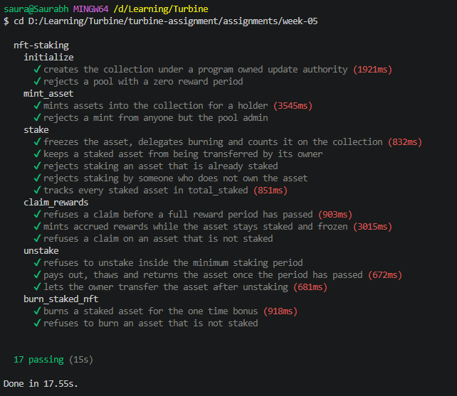

# Week 5 — Metaplex Core NFT Staking

An Anchor program that stakes Metaplex Core NFTs. A staked asset is frozen in place
by a freeze delegate the program controls, earns reward tokens per period, can pay
out without being unstaked, can be burned for a one-time bonus, and is counted on
the collection itself through an on-chain attribute.

| | |
|---|---|
| Program | `nft_staking` |
| ID (localnet) | `6YezEsD1WUPGhJJpXrrWtkgbn68s71dgFqv3vwPzBJVB` |
| Metaplex Core | `CoREENxT6tW1HoK8ypY1SxRMZTcVPm7R94rH4PZNhX7d` |
| Crates | Anchor 0.32 · `mpl-core 0.11.2` |

Rust 1.95 · Solana CLI 2.2.7 · tested against a local validator.

---

## Design

Each staking pool is a Core collection plus three program accounts.

| Account | Address | Role |
|---|---|---|
| `update_authority` | `["update_authority", collection]` | Collection update authority, freeze and burn delegate on every staked asset |
| `config` | `["config", collection]` | Admin, reward rate, period, minimum stake time, burn bonus |
| `rewards_mint` | `["rewards", config]` | SPL reward token, 6 decimals, minted by `config` |

`initialize` creates the collection with `update_authority` as its update authority
and an `Attributes` plugin holding `total_staked = 0`. Because the program owns the
update authority, it is the only party that can mint assets into the collection,
write staking attributes on those assets, and update the collection's counter.

| Instruction | Signer | Effect |
|---|---|---|
| `initialize(args)` | admin | Collection, config and reward mint in one step |
| `mint_asset(name, uri)` | admin | Mints a Core asset into the collection for a holder |
| `stake` | owner | Freeze and burn delegates, staking attributes, `total_staked + 1` |
| `claim_rewards` | owner | Task 1.1 — pays accrued rewards, the asset stays frozen |
| `unstake` | owner | Pays the remainder, thaws, removes both delegates, `total_staked - 1` |
| `burn_staked_nft` | owner | Task 1.2 — pays accrued rewards plus the bonus, burns, `total_staked - 1` |

---

## Staking

`stake` adds three plugins to the asset:

| Plugin | Managed by | Authority | Purpose |
|---|---|---|---|
| `FreezeDelegate { frozen: true }` | owner | `update_authority` PDA | the owner cannot transfer or burn it |
| `BurnDelegate` | owner | `update_authority` PDA | lets the program burn it later |
| `Attributes` | update authority | collection update authority | `staked`, `staked_at`, `last_claimed` |

The two delegates are owner-managed plugins, so the owner signs to add them and
hands their authority to the PDA. `Attributes` is authority-managed, so the PDA
signs for it as the collection's update authority. Restaking an asset that was
staked before updates its existing attributes instead of adding a second plugin.

An asset only counts as staked when it carries a frozen `FreezeDelegate` whose
authority is this pool's PDA **and** its `staked` attribute is `true`. Checking the
delegate's authority matters. An owner could otherwise freeze their own asset with a
delegate they control, then claim rewards from leftover attributes without the
program ever holding it.

---

## Task 1.1 — Claim without unstaking

```
periods = (now - last_claimed) / period_seconds
reward  = periods * rewards_per_period
```

`claim_rewards` mints `reward` to the owner's associated token account, creating it
if needed, and advances `last_claimed` by `periods * period_seconds` rather than
setting it to `now`. The partial period that has not finished yet carries over to
the next claim instead of being lost. It never touches the freeze delegate, so the
asset stays staked and frozen. A claim with no full period behind it fails with
`NothingToClaim`.

---

## Task 1.2 — Burn to earn

`burn_staked_nft` pays the accrued rewards plus `burn_bonus`, then:

1. thaws the `FreezeDelegate`, since a frozen asset cannot be burned
2. burns the asset through `BurnV1`, signed by the PDA as `BurnDelegate` authority
3. decrements `total_staked`

All three happen in one instruction, so the asset is never thawed and left
transferable. The owner signs the transaction but the burn itself is authorised
by the delegate granted at stake time. Core leaves a single `Uninitialized` byte at
the asset's address so it can never be recreated, which the test checks.

---

## Task 1.3 — `total_staked` on the collection

The counter is an `Attributes` entry on the collection account, not program state,
so wallets and indexers read it straight from the collection.

| Event | `total_staked` |
|---|---|
| `initialize` | set to `0` |
| `stake` | `+ 1` |
| `unstake` | `- 1` |
| `burn_staked_nft` | `- 1` |

Each update reads the collection's attribute list, changes the one entry and writes
the list back with `UpdateCollectionPluginV1`, signed by the PDA. The value can
never go below zero.

---

## Typed Core accounts

`mpl-core` has an `anchor` feature, but every release pins `anchor-lang ^0.31`, which
does not work with Anchor 0.32. The program uses `mpl-core 0.11.2` without it and
defines three small wrappers instead:

| Wrapper | Validates |
|---|---|
| `Account<'info, CoreAsset>` | owned by Metaplex Core, `key == AssetV1` |
| `Account<'info, CoreCollection>` | owned by Metaplex Core, `key == CollectionV1` |
| `Program<'info, MplCore>` | address is the Core program |

Anchor still checks ownership and deserializes the accounts before the handler runs,
so no instruction takes an unchecked account. Plugins are read with
`fetch_asset_plugin` and `fetch_collection_plugin`.

---

## Build and test

Solana tooling on Windows needs flags the plain Anchor commands do not set, so each
step is run on its own.

```bash
cargo build-sbf --tools-version v1.52

mkdir -p target/idl target/types
anchor idl build -p nft_staking -o target/idl/nft_staking.json -t target/types/nft_staking.ts

yarn install
```

Start a validator with Metaplex Core loaded at its real address:

```bash
solana-test-validator --reset \
  --bpf-program CoREENxT6tW1HoK8ypY1SxRMZTcVPm7R94rH4PZNhX7d tests/fixtures/mpl_core.so
```

Deploy and run the suite in another terminal:

```bash
solana program deploy target/deploy/nft_staking.so --program-id target/deploy/nft_staking-keypair.json --url http://127.0.0.1:8899

export ANCHOR_PROVIDER_URL="http://127.0.0.1:8899"
export ANCHOR_WALLET="$HOME/.config/solana/id.json"
yarn run ts-mocha -p ./tsconfig.json -t 1000000 "tests/**/*.ts"
```

`tests/fixtures/mpl_core.so` is the Core program dumped from devnet, committed so the
tests always run against the same build:

```bash
solana program dump CoREENxT6tW1HoK8ypY1SxRMZTcVPm7R94rH4PZNhX7d tests/fixtures/mpl_core.so -u devnet
```

The build prints a stack-offset warning for `registry_records_to_plugin_list` inside
`mpl-core`. That function backs the crate's full `Asset` and `Collection` decoders,
which this program never calls.

---

## Tests



The suite runs two pools: a fast one with a one-second period and a three-second
minimum stake, used for the timing paths, and a slow one with one-hour values,
where claims and early unstakes fail deterministically.

| Test | Verifies |
|---|---|
| creates the collection under a program owned update authority | update authority PDA, `total_staked = 0`, config, mint authority |
| rejects a pool with a zero reward period | `InvalidPeriod` |
| mints assets into the collection for a holder | owner, collection membership, collection size |
| rejects a mint from anyone but the pool admin | `ConstraintHasOne` |
| freezes the asset, delegates burning and counts it on the collection | frozen delegate and burn delegate held by the PDA, attributes, `total_staked = 1` |
| keeps a staked asset from being transferred by its owner | Core rejects the transfer |
| rejects staking an asset that is already staked | `AlreadyStaked` |
| rejects staking by someone who does not own the asset | `NotOwner` |
| tracks every staked asset in total_staked | `total_staked = 2` |
| refuses a claim before a full reward period has passed | `NothingToClaim` |
| mints accrued rewards while the asset stays staked and frozen | minted amount equals periods times rate, still frozen |
| refuses a claim on an asset that is not staked | `NotStaked` |
| refuses to unstake inside the minimum staking period | `StakeLocked` |
| pays out, thaws and returns the asset once the period has passed | remainder paid, both delegates removed, `total_staked - 1` |
| lets the owner transfer the asset after unstaking | Core accepts the transfer |
| burns a staked asset for the one time bonus | exactly the bonus minted, asset burned, collection size and `total_staked` down |
| refuses to burn an asset that is not staked | `NotStaked` |

Reward assertions are computed from the on-chain `last_claimed` values before and
after each call, so they hold exactly no matter how long the validator takes.

---

## Scope

Task 1 is implemented in full. The optional Task 2, the time-based transfer oracle,
is not attempted.
